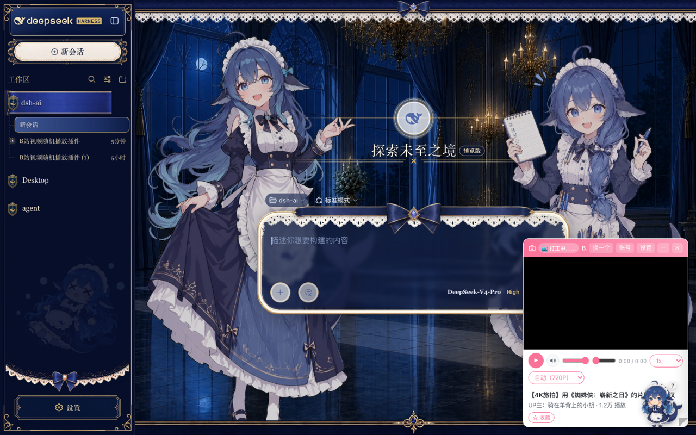

# dsh-bili-taskmaster

DSH Web GUI 内的 B 站随机视频小窗 —— **Bilibili 鲸鱼监工** 🐳。在你打工时随机播 B 站视频，任务干完它会停下来喊你来验收。



## 功能介绍

- 🐳 **任务联动**：DSH 任务运行时播放，任务完成（`running → idle`）弹出 🎉 验收动画；可开启「任务完成后自动暂停」。
- 📺 **可拖拽、可缩放**：拖动标题栏移动，右下角拖拽缩放，支持最小化 / 关闭。
- 🎞️ **多档画质**：1080P（DASH + MediaSource）、720P / 480P / 360P（MP4 流式代理），画质选择跨视频记住。
- 💬 **弹幕**：字号 / 密度滑杆、暂停冻结、滚动轨道避让防重叠；约每 26 秒有 55% 概率刷一条橙色鲸鱼彩蛋弹幕。
- 🔐 **扫码登录**：站内生成二维码 + 轮询，登录态持久化到 DSH 的 `credentials`（源码不硬编码任何密钥）。
- 🔁 **自动连播**：播完自动下一个，预载队列（10 个）+ moov 快启缓存。
- ⭐ **收藏**：一键收藏到默认收藏夹；播放 / 静音 / 音量 / 进度 / 倍速控制齐全。

## 安装

```bash
dsh plugin --profile web add dsh-bili-taskmaster
```

重启 `dsh web`，刷新页面，右下角出现「📺 Bilibili 鲸鱼监工」即安装成功。

## License

[MIT](./LICENSE)
